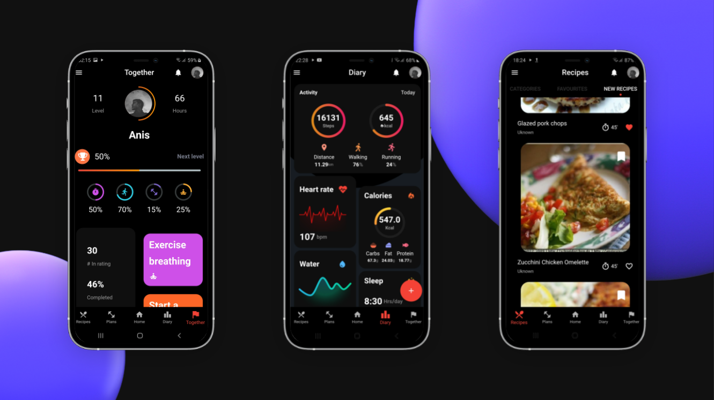
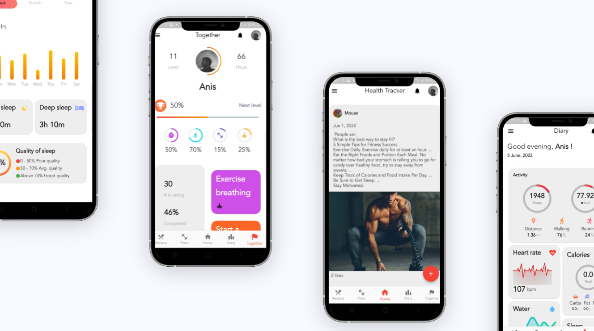

# 
  Health Tracker 

A mobile application with the goal of helping people track their fitness progress, encourage a healthier lifestyle using gamification, and connect fitness enthusiasts from around the world.

# Core Features 
- a diary for tracking daily activity, weight, calories, nutrition, water, heart rate ...etc
- healthy recipes based on your fitness goals with nutrition details and cooking steps.
- workouts and diet plans.
- daily, weekly, and monthly challenges.
- a community feed.

- ## Additional Features
- Firebase authentication (Email, Google, Facebook)
- Firebase Firestore & Cloud Storage integration
- API integration (Spoonacular, FDC, Open Food Facts... etc)
- Heart rate sensor
- Barcode scanner

# Built with 
 -  Flutter 
 -  Firebase

# screenshots 

## Getting Started
Step-1 Download or clone this repository -

    git clone https://github.com/anisdhia/health_tracker.git

Step-2 Open the root directory and type this command -

    flutter pub get

Step-1 Run the app -

    flutter run

## Required Tools
- Android Studio
- Visual Studio Code (Optional)
- Flutter
- Dart
- Firebase
